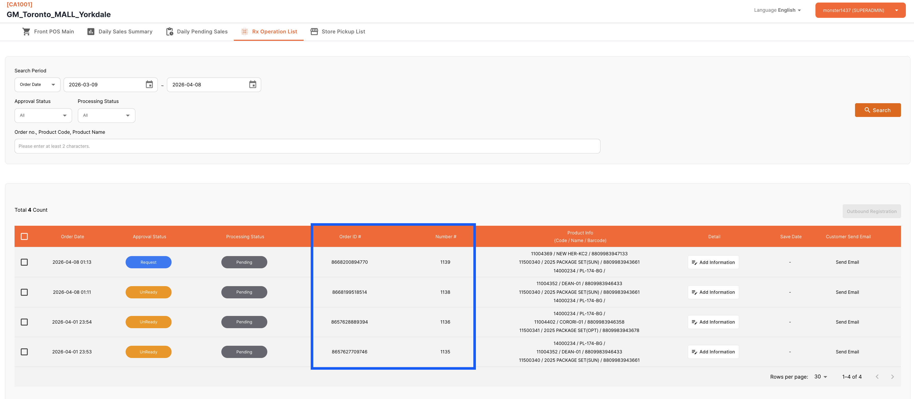

# 📍 Shopify RX 처방전 등록 및 출고

> Shopify에서 발생한 RX 매출 주문의 조회, 처방 정보 등록, Lab 출고 및 배송 라벨 출력까지의 전체 흐름을 안내합니다.
>
> 경로 : IIC BO > POS > RX Operation View

---

## 👉 RX 주문 전체 흐름

> **Unready** → **Request** → **Confirm** → **출고 등록** → **배송 라벨 출력**

| 단계 | 상태 | 처리 주체 | 설명 |
|:---:|---|---|---|
| 1 | **Unready** | Shopify | RX 주문 생성 (필수 정보 미등록) |
| 2 | **Request** | 스토어 | 처방 정보 등록 완료 → Lab에 요청 |
| 3 | **Confirm / Reject** | Lab 작업자 | 정보 확인 후 가능 여부 판단 |
| 4 | **Confirm** | 스토어 | 승인된 주문 → 출고 등록 가능 |
| 5 | **출고 완료** | 스토어 | 출고 등록 + 배송 라벨 출력 |

---

## 1. RX 주문 확인

Shopify에서 일반 매출과 달리 **RX 매출**이 발생되면, POS > RX Operation View 목록에서 **Unready** 상태로 확인할 수 있습니다.

> RX 주문은 반드시 Shopify에서 **Unfulfill** 처리가 반영된 주문으로 생성해야 합니다.

| 상태 | 설명 |
|---|---|
| **Unready** | 주문만 생성된 상태로, 필수 정보가 아직 반영되지 않은 **미준비 주문** |

## 2. 처방 & 고객 정보 등록

스토어 옵티션(직원)은 해당 주문의 상세를 진입하여, 고객이 처방 정보를 전달하는 방식에 따라 정보를 등록할 수 있습니다.

### 온라인 마이페이지에 처방전이 등록된 경우

고객이 이미 온라인 마이페이지 내 **나의 정보**에 처방전을 등록해둔 경우, 아래 절차로 처방 정보를 반영할 수 있습니다.

> 1. 멤버십 조회 방식과 동일하게 **멤버십을 조회**합니다.
> 2. 해당 ID에 사전 등록된 **처방전 목록**이 조회됩니다.
> 3. 처방전 1개를 선택한 후, **View** 버튼을 통해 저장된 처방전 이미지를 확인할 수 있습니다.
> 4. 처방전을 선택하면, 하단의 **Prescription** 정보가 자동으로 반영됩니다.

- 만료 기간이 지난 처방전은 목록에서 **자동 제외**되어 표시되지 않습니다.
- <mark>멤버십 정보에 포함된 처방전을 선택하면 Prescription 정보가 자동 반영되므로, 별도 입력이 필요 없습니다.</mark>

처방 정보 등록이 완료되면 주문 상태가 **Request**로 변경되며, Lab 작업자에게 요청이 전달됩니다.

## 3. Lab 확인 및 승인

Lab 작업자(렌즈 작업자)가 등록된 정보를 확인하고 가능 여부를 판단하여 **Confirm** 또는 **Reject** 처리를 진행합니다.

| 결과 | 설명 |
|---|---|
| **Confirm** | 작업 가능 → 스토어에서 출고 등록 진행 |
| **Reject** | 작업 불가 → 사유 확인 후 재등록 필요 |

---

## 4. 출고 생성 (Outbound Registration)

POS > RX Operation View 에서 **Confirm** 상태인 주문들을 모아 출고 등록을 처리합니다.

| 항목 | 설명 |
|---|---|
| **출고 단위** | 여러 주문을 포괄하여 **1건의 출고**로 처리 |
| **연계 시스템** | IIC BO 출고 등록 + **Netsuite TO** 자동 생성 |

> BO 등록 완료 후 **NS TO 생성에 실패**한 경우, 배송 등록 시 다음 단계로 넘어가지 못하도록 방어 처리됩니다.
>
> 출고 완료는 **배송 라벨 출력까지 완료**되어야 최종 처리됩니다.

## 5. 배송 등록 (TMS 요청)

| 조건 | 동작 |
|---|---|
| IIC BO 출고 등록 + NS TO 생성 **완료** | TMS 배송 요청 자동 전송 |

## 6. 배송 라벨 등록

| 조건 | 동작 |
|---|---|
| TMS 배송 정보 **수신 완료** | 라벨 정보 등록 |
| TMS 배송 정보 **미수신** | 실패 처리 |

## 7. 배송 라벨 출력

### Outbound Label Print 목록

Front POS > Outbound Label Print 에서 출고 목록의 진행 사항을 확인합니다.

| 항목 | 설명 |
|---|---|
| **Create Date** | 출고 생성 일시 |
| **Outbound No.** | 출고 번호 |
| **Order No.** | 주문 번호 |
| **Product Info** | 제품 코드 / 바코드 |
| **Qty** | 수량 |
| **Tracking No.** | 배송사 송장 번호 |
| **Print** | 라벨 등록 요청 및 출력 버튼 |

### 출력 절차

> 1. 라벨 등록 요청 후, **Tracking No.**가 성공적으로 수신되면 출력 가능 상태로 전환됩니다.
> 2. **Print shipping labels** 버튼이 활성화됩니다.
> 3. 버튼 선택 시 프린터 시스템 팝업 노출 후, **B2B 송장 1개**가 라벨 프린터로 출력됩니다.

## 8. 처리 실패 시

- 버튼 선택 시 우측 상단에 시스템 **실패 얼럿**이 노출됩니다.

| 확인 사항 | 조치 |
|---|---|
| 어떤 처리에서 에러가 발생했는지 확인 | 시스템 Operation 채널(Slack)을 통해 IT팀에 대응 요청 |

---

## ❓ FAQ

> **Q. RX Operation View에서 주문이 보이지 않아요.**
>
> A. Shopify에서 해당 주문이 <u>Unfulfill</u> 상태로 생성되었는지 확인해 주세요.
>
> Unfulfill 처리가 되지 않은 주문은 RX Operation View에 표시되지 않습니다.

> **Q. 고객의 처방전이 조회되지 않아요.**
>
> A. 만료 기간이 지난 처방전은 <u>자동 제외</u>되어 표시되지 않습니다.
>
> 고객에게 유효한 처방전을 온라인 마이페이지에 재등록하도록 안내해 주세요.

> **Q. 처방전 이미지를 확인하고 싶어요.**
>
> A. 처방전 목록에서 1개를 선택한 후 <u>View</u> 버튼을 통해 저장된 처방전 이미지를 조회할 수 있습니다.

> **Q. 출고 등록 후 Tracking No.가 생성되지 않아요.**
>
> A. TMS 배송 요청이 정상 처리되었는지 확인해 주세요.
>
> 수신된 정보가 없는 경우 시스템 Operation 채널(Slack)을 통해 IT팀에 문의해 주세요.

> **Q. 라벨 출력 버튼이 활성화되지 않아요.**
>
> A. <u>Tracking No.</u>가 정상 수신되어야 라벨 출력이 가능합니다.
>
> 배송 라벨 등록 단계에서 정보 수신이 완료되었는지 확인해 주세요.

> **Q. 여러 주문을 하나의 출고로 묶을 수 있나요?**
>
> A. RX Operation View에서 <u>Confirm</u> 상태인 주문들을 모아 1건의 출고로 등록할 수 있으며, <u>B2B 송장 1개</u>로 출력됩니다.

