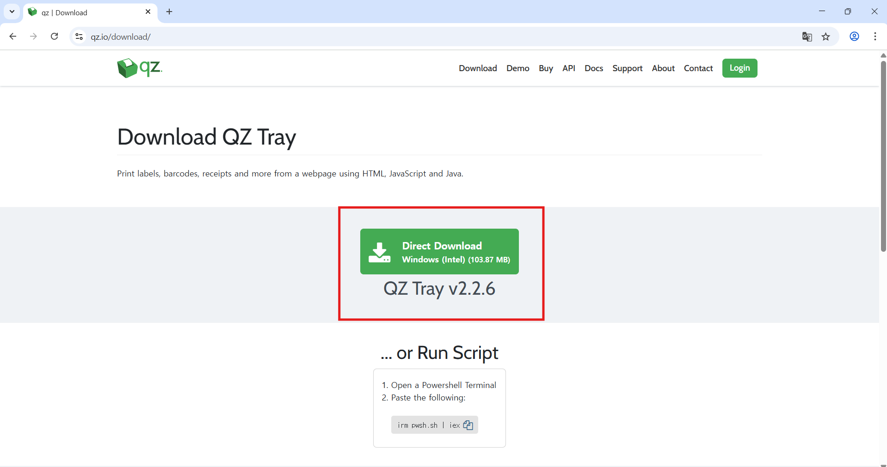
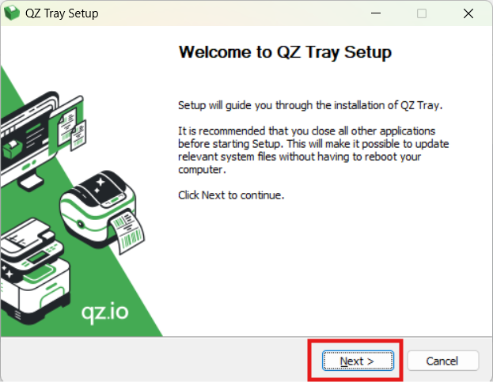
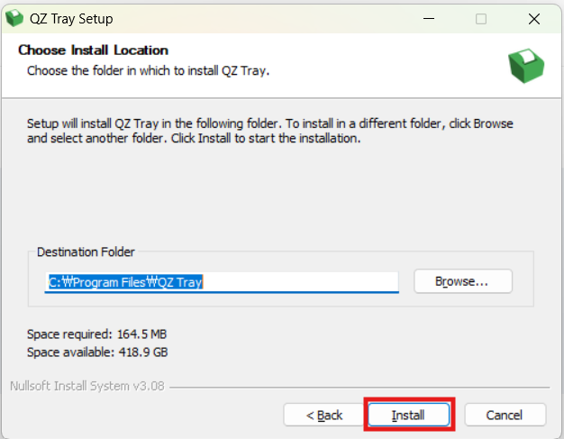
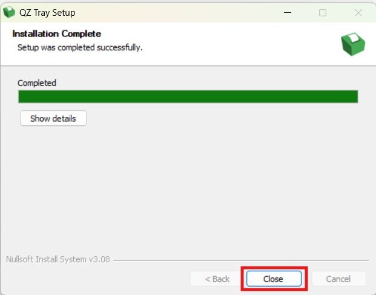
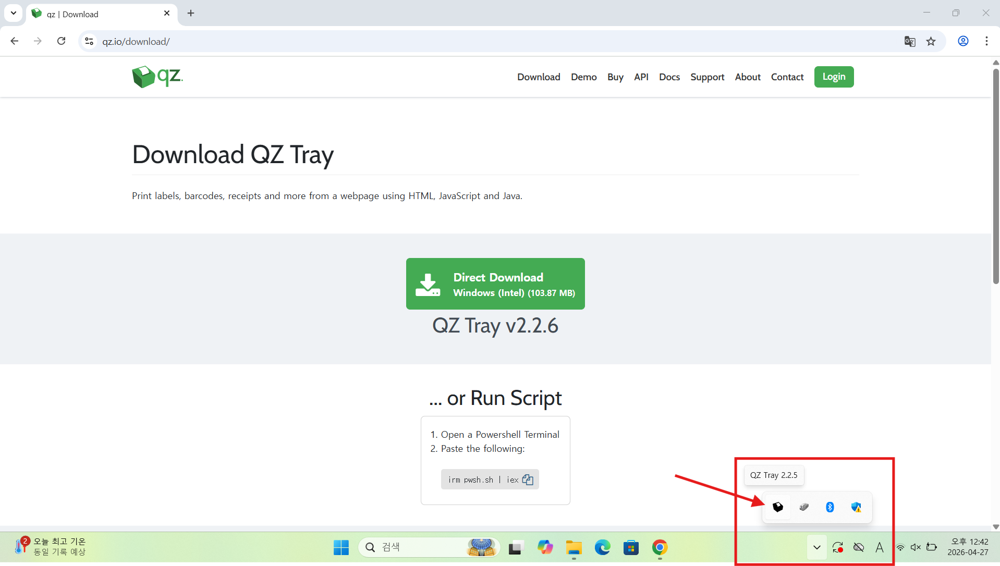
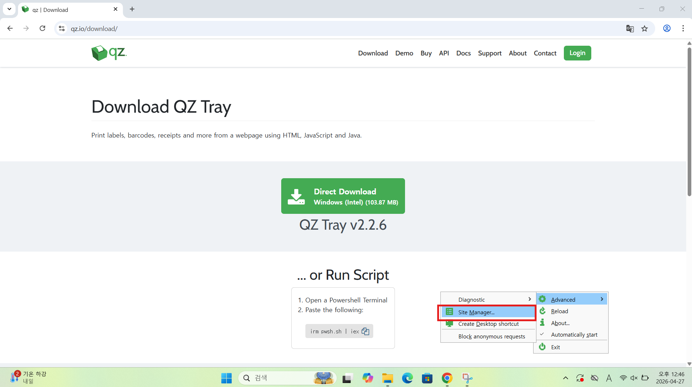
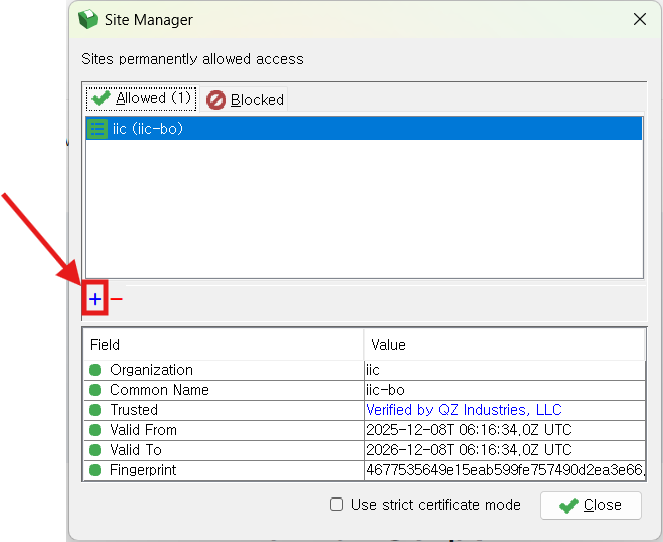
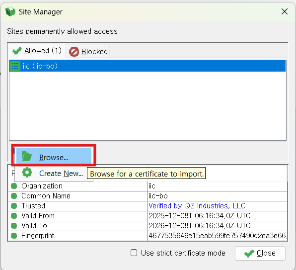
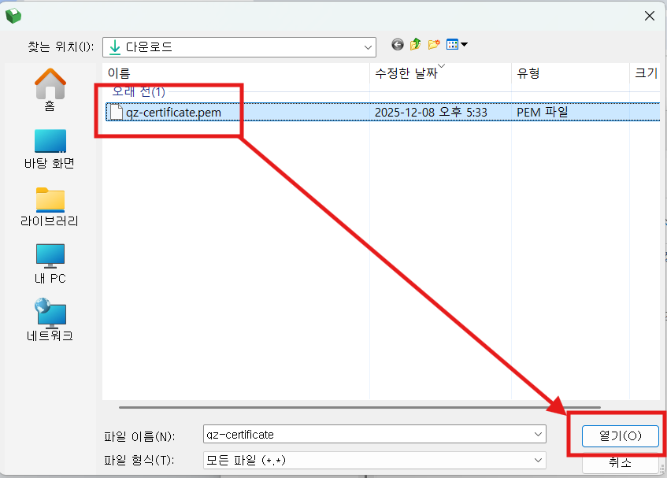
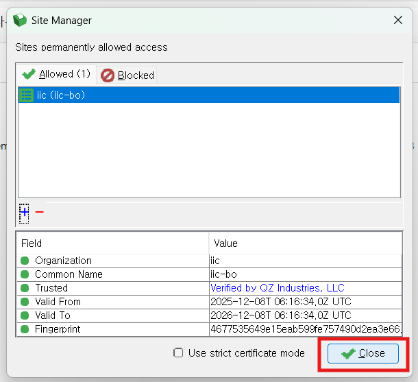

# 📍 AC Card Printer Setup

> A guide for installing the printer driver for AC Card printing.

---

## 1. Printer Driver Installation

| Step | Details |
|:---:|---|
| **a** | Connect the printer to your PC and **verify the printer is powered on** |
| **b** | Download and install the driver that matches your printer model and PC OS |
| | ⅰ. `DDInstall` |
| | ⅱ. Local USB Port |
| **c** | Driver download: https://www.idp-corp.com/index_kor/bbs/board.php?bo_table=s4_1 |
| **d** | **Restart your PC** after installation |

---

## 2. QZ Tray Installation

> **Step a.** Go to https://qz.io/download/ and click the **Direct Download** button.

---

> **Step b.** When the setup wizard launches, click **Next >**.

---

> **Step c.** Verify the installation path and click **Install**.

---

> **Step d.** Once the installation is complete, click **Close**.

---

## 3. QZ Tray .pem File Setup

Register the `qz-certificate.pem` file in QZ Tray Site Manager.

> 📎 <a href="/qz-certificate.pem" download>Download qz-certificate.pem</a>

---

> **Step a.** Check that the **QZ Tray icon** is running in the bottom-right taskbar.

---

> **Step b.** Right-click the QZ Tray icon and select **Advanced → Site Manager...**.

---

> **Step c.** Click the **`+` icon** in the Site Manager window.

---

> **Step d.** Click **Browse...**.

---

> **Step e.** Select the `qz-certificate.pem` file from your Downloads folder and click **Open**.

---

> **Step f.** Verify that the `iic (iic-bo)` certificate is registered under the **Allowed** tab, then click **Close**.

---

> **Step g.** **Reboot your PC** to apply the settings.

---
